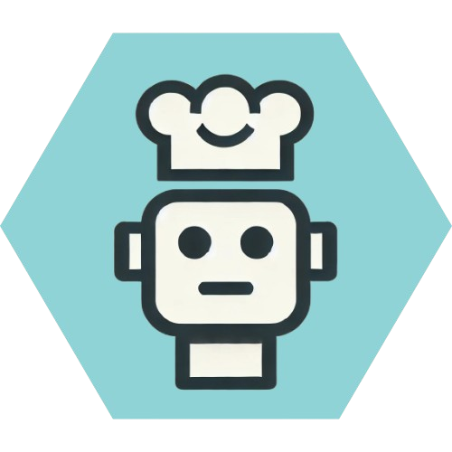

<!-- Improved compatibility of back to top link: See: https://github.com/othneildrew/Best-README-Template/pull/73 -->
<a id="readme-top"></a>
<!--
*** Thanks for checking out the Best-README-Template. If you have a suggestion
*** that would make this better, please fork the repo and create a pull request
*** or simply open an issue with the tag "enhancement".
*** Don't forget to give the project a star!
*** Thanks again! Now go create something AMAZING! :D
-->


<!-- PROJECT SHIELDS -->
<!--
*** I'm using markdown "reference style" links for readability.
*** Reference links are enclosed in brackets [ ] instead of parentheses ( ).
*** See the bottom of this document for the declaration of the reference variables
*** for contributors-url, forks-url, etc. This is an optional, concise syntax you may use.
*** https://www.markdownguide.org/basic-syntax/#reference-style-links
-->
[![Contributors][contributors-shield]][contributors-url]
[![Forks][forks-shield]][forks-url]
[![Stargazers][stars-shield]][stars-url]
[![Issues][issues-shield]][issues-url]
[![project_license][license-shield]][license-url]
[![LinkedIn][linkedin-shield]][linkedin-url]


<!-- PROJECT LOGO -->
<br />
<div align="center">
  <a href="https://github.com/chipanyanwu/YesChef">
    
  </a>

<h3 align="center">YesChef: Your personal AI-powered sous chef. </h3>

  <p align="center">
    project_description
    <br />
    <a href="https://github.com/chipanyanwu/YesChef"><strong>Explore the docs »</strong></a>
    <br />
    <br />
    <a href="https://yes-chef-e36a7.web.app/">View Demo</a>
    &middot;
    <a href="https://github.com/chipanyanwu/YesChef/issues/new?labels=bug&template=bug-report---.md">Report Bug</a>
    &middot;
    <a href="https://github.com/chipanyanwu/YesChef/issues/new?labels=enhancement&template=feature-request---.md">Request Feature</a>
  </p>
</div>


<!-- TABLE OF CONTENTS -->
<details>
  <summary>Table of Contents</summary>
  <ol>
    <li>
      <a href="#about-the-project">About The Project</a>
      <ul>
        <li><a href="#built-with">Built With</a></li>
      </ul>
    </li>
    <li>
      <a href="#getting-started">Getting Started</a>
      <ul>
        <li><a href="#prerequisites">Prerequisites</a></li>
        <li><a href="#installation">Installation</a></li>
      </ul>
    </li>
    <li><a href="#usage">Usage</a></li>
    <li><a href="#roadmap">Roadmap</a></li>
    <li><a href="#contributing">Contributing</a></li>
    <li><a href="#license">License</a></li>
    <li><a href="#contact">Contact</a></li>
    <li><a href="#acknowledgments">Acknowledgments</a></li>
  </ol>
</details>


<!-- ABOUT THE PROJECT -->
## About The Project

[![Product Name Screen Shot][product-screenshot]](https://yes-chef-e36a7.web.app/)

YesChef is an innovative website and app designed to assist users in the kitchen by providing hands-free cooking guidance. With voice input and output, users can interact with the app without touching a screen or keyboard—perfect for when their hands are dirty from cooking. Whether you're a beginner or an experienced chef, YesChef makes cooking easier and more efficient. A screenshot is shown above!

Features:

* Voice Control: Ask for step-by-step instructions or clarifications without touching your device.
* Hands-Free Operation: Voice input and output keep your hands free for cooking.
* Interactive Recipe Guidance: Get real-time feedback and highlights of the current cooking step.
* Ingredient List: View ingredients clearly and check them off as you go.
* Cooking and Prep Times: See how long each step and the overall recipe will take.
* Image Assistance: View images for extra clarification, ensuring you understand each step clearly.
* Standardized Recipe Display: Recipes are beautifully formatted into a clean, user-friendly HTML page, making them easy to follow.
* YesChef is the perfect cooking companion for those who want to focus on the art of cooking without constantly needing to touch or scroll through a device.


<p align="right">(<a href="#readme-top">back to top</a>)</p>


### Built With

* [![React][React.js]][React-url]
* React Speech Recognition library
* React Query
* Vite
* TailwindCSS
* Firebase

<p align="right">(<a href="#readme-top">back to top</a>)</p>


<!-- GETTING STARTED -->
## Getting Started

This is an example of how you may give instructions on setting up your project locally.
To get a local copy up and running follow these simple example steps.

### Prerequisites

This is an example of how to list things you need to use the software and how to install them.
* npm
  ```sh
  npm install npm@latest -g
  ```

### Installation

1. Get a Gemini API key at Google AI Studio ([API key docs](https://ai.google.dev/gemini-api/docs/api-key))
2. Clone the repo
   ```sh
   git clone [https://github.com/github_username/repo_name.git](https://github.com/chipanyanwu/YesChef.git)
   ```
3. Install NPM packages
   ```sh
   npm install
   ```
4. Create a `.env` and enter your API.
   ```js
   VITE_GEMINI_API_KEY=<ENTER YOUR API>
   ```
5. Check that it's working by locally hosting it
   ```sh
   npm run dev
   ```
<p align="right">(<a href="#readme-top">back to top</a>)</p>


<!-- USAGE EXAMPLES -->
## Usage

Use this space to show useful examples of how a project can be used. Additional screenshots, code examples and demos work well in this space. You may also link to more resources.

Note that image functionality is not merged into main.

_For more examples, please refer to the [Documentation](https://example.com)_

<p align="right">(<a href="#readme-top">back to top</a>)</p>


<!-- ROADMAP -->
## Roadmap

- [ ] Integrated timers
- [ ] "Hey Siri"-style voice activation
- [ ] Pulling recipes from social media

<p align="right">(<a href="#readme-top">back to top</a>)</p>

<!-- CONTACT -->
## Contact

Chip Anyanwu - chibuezeanyanwu2025@u.northwestern.edu
Brooks Hu - brookshu2026@u.northwestern.edu
Davi Maciel - davimacieldias2025@u.northwestern.edu
Theo Maurino - theomaurino2026@u.northwestern.edu
Nick Qiu - nicholasqiu2026@u.northwestern.edu
Yindi Zhao - yindizhao2026@u.northwestern.edu

<p align="right">(<a href="#readme-top">back to top</a>)</p>


<p align="right">(<a href="#readme-top">back to top</a>)</p>


<!-- MARKDOWN LINKS & IMAGES -->
<!-- https://www.markdownguide.org/basic-syntax/#reference-style-links -->
[contributors-shield]: https://img.shields.io/github/contributors/chipanyanwu/YesChef.svg?style=for-the-badge
[contributors-url]: https://github.com/chipanyanwu/YesChef/graphs/contributors
[forks-shield]: https://img.shields.io/github/forks/chipanyanwu/YesChef.svg?style=for-the-badge
[forks-url]: https://github.com/chipanyanwu/YesChef/network/members
[stars-shield]: https://img.shields.io/github/stars/chipanyanwu/YesChef.svg?style=for-the-badge
[stars-url]: https://github.com/chipanyanwu/YesChef/stargazers
[issues-shield]: https://img.shields.io/github/issues/chipanyanwu/YesChef.svg?style=for-the-badge
[issues-url]: https://github.com/chipanyanwu/YesChef/issues
[license-shield]: https://img.shields.io/github/license/chipanyanwu/YesChef.svg?style=for-the-badge
[license-url]: https://github.com/chipanyanwu/YesChef/blob/master/LICENSE.txt
[linkedin-shield]: https://img.shields.io/badge/-LinkedIn-black.svg?style=for-the-badge&logo=linkedin&colorB=555
[linkedin-url]: https://linkedin.com/in/linkedin_username
[product-screenshot]: public/images/demo-screenshot.png
[Next.js]: https://img.shields.io/badge/next.js-000000?style=for-the-badge&logo=nextdotjs&logoColor=white
[Next-url]: https://nextjs.org/
[React.js]: https://img.shields.io/badge/React-20232A?style=for-the-badge&logo=react&logoColor=61DAFB
[React-url]: https://reactjs.org/
[Vue.js]: https://img.shields.io/badge/Vue.js-35495E?style=for-the-badge&logo=vuedotjs&logoColor=4FC08D
[Vue-url]: https://vuejs.org/
[Angular.io]: https://img.shields.io/badge/Angular-DD0031?style=for-the-badge&logo=angular&logoColor=white
[Angular-url]: https://angular.io/
[Svelte.dev]: https://img.shields.io/badge/Svelte-4A4A55?style=for-the-badge&logo=svelte&logoColor=FF3E00
[Svelte-url]: https://svelte.dev/
[Laravel.com]: https://img.shields.io/badge/Laravel-FF2D20?style=for-the-badge&logo=laravel&logoColor=white
[Laravel-url]: https://laravel.com
[Bootstrap.com]: https://img.shields.io/badge/Bootstrap-563D7C?style=for-the-badge&logo=bootstrap&logoColor=white
[Bootstrap-url]: https://getbootstrap.com
[JQuery.com]: https://img.shields.io/badge/jQuery-0769AD?style=for-the-badge&logo=jquery&logoColor=white
[JQuery-url]: https://jquery.com 
